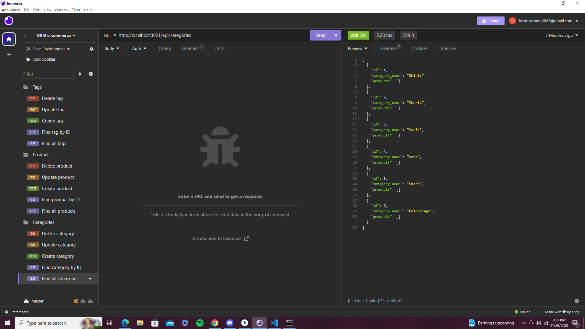

# ORM-E-commerce

## Description 

The backend database is designed for e-commerce websites, utilizing the Express.js API and Sequelize to establish a connection with the MySQL database. It enables users to generate a development database, populate it with test data, and synchronize Sequelize models with the MySQL database. Users can leverage GET, POST, PUT, and DELETE routes to view and modify data in the user database. Explore its capabilities and witness how it can elevate your company to new heights!


# Overview

## The Challenge: 

My task is to build the back end for an e-commerce site by modifying starter code. You’ll configure a working Express.js API to use Sequelize to interact with a MySQL database.

## Acceptance Criteria

```md
GIVEN a functional Express.js API
WHEN I add my database name, MySQL username, and MySQL password to an environment variable file
THEN I am able to connect to a database using Sequelize
WHEN I enter schema and seed commands
THEN a development database is created and is seeded with test data
WHEN I enter the command to invoke the application
THEN my server is started and the Sequelize models are synced to the MySQL database
WHEN I open API GET routes in Insomnia for categories, products, or tags
THEN the data for each of these routes is displayed in a formatted JSON
WHEN I test API POST, PUT, and DELETE routes in Insomnia
THEN I am able to successfully create, update, and delete data in my database
```

## Usage 

Link to walkthrough video: https://youtu.be/lHqlel9YCwA?si=eB-d-zT94ofQerIb



## Contribution 

Follow me on Github at [felipeokay](https://github.com/felipeokay) 

 For any questions please contact me via email at: Kevinserrano0823@gmail.com
